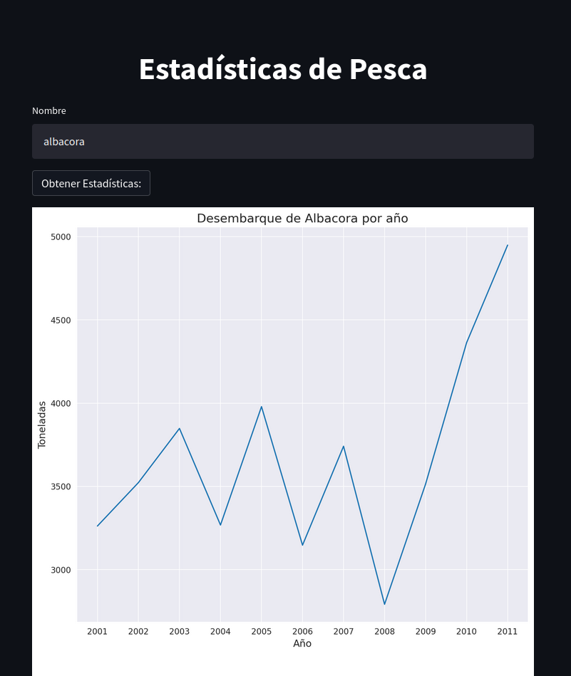

# Fish Analysis App Test Using PSQL Database and Streamlit

This is a test for an Streamlit App querying into a PostgresSQL Database.

Consists into plotting 3 Seaborns's lineplots.

## Requirements

The program was written using a Python 3.9 environment, and the following libraries:

- [NumPy](http://www.numpy.org/)
- [Pandas](http://pandas.pydata.org/)
- [Matplotlib](http://matplotlib.org/)
- [Seaborn](https://seaborn.pydata.org/)
- [Streamlit](https://streamlit.io/)
- [Psycopg2](https://www.psycopg.org/docs/)
- [Tabula-py](https://pypi.org/project/tabula-py/)


## Dataset

The data was extracted from the 
[Sernapesca anuary pdf](http://www.sernapesca.cl/sites/default/files/2011_0.pdf)
file.

On the terminal, run 
```
python pdf_converter.py
```
to get the CSV files. Then, create a PSQL Database called `fishdb`, and run
```
python create_tables.py
```
and
```
python data_preparation.py
```
to fill the Database with the data extracted.

## Implementation

On the terminal, run
```
streamlit run app.py
```
to get access to the Steamlit App.

## Examples

 


## Support

Give a :star: if you like it :hugs:.
